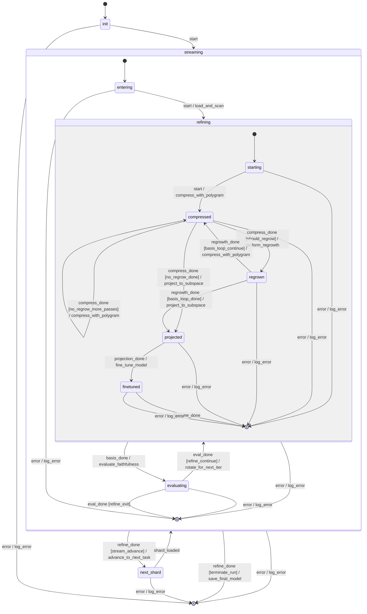

# Advanced FSM options: continual-learning forge

> **Status:** v0.2.0 (continual-learning extension). Every knob in this
> document ships behind a default that preserves v0.1 byte-identical
> behavior — set them explicitly to opt in.

The default `sae-forge forge` command runs a single-shard pipeline:
load → compress → optional regrow → project → fine-tune → evaluate
→ done. That is the v0.1 behavior and remains the default.

This document covers the v0.2 extension: a configurable
**continual-learning loop** built from three nested loops over the
same FSM. Every option here defaults to a value that recovers the
v0.1 single-shard pipeline byte-identically; you only pay for what
you turn on.

## The three loops

The forge FSM is composed from three nested orca sub-machines —
`StreamMachine` (outer, shard handling), `RefineMachine` (middle,
per-shard convergence), and `BasisMachine` (innermost,
compress/regrow loop). The diagram below is **auto-generated** from
the parsed hierarchy by `saeforge.machines.visualize.to_mermaid`;
a CI test (`tests/fsm/test_diagram_drift.py`) asserts this block
matches the live emit, so it can never drift from the source of
truth in `saeforge/machines/{stream,refine,basis}.orca.md`.

To regenerate after editing the machine files:

```bash
sae-forge inspect --fsm-diagram
```

<!-- BEGIN AUTO-GENERATED FSM DIAGRAM -->

<!-- END AUTO-GENERATED FSM DIAGRAM -->

Plain ASCII version of the same diagram (renders without mermaid):

```
┌──────────── stream loop (per task / shard) ────────────┐
│                                                        │
│  loaded → activations_scanned → ┌── basis loop ──┐     │
│                                 │ compressed ↔   │     │
│                                 │   regrown      │     │
│                                 └────────────────┘     │
│            → projected → finetuned → evaluated         │
│                                       │                │
│   ┌───────────────────────────────────┘                │
│   │ advance_stream  →  loaded (next shard) ────────────│ stream
│   │                                                    │
│   │ refine same    →  compressed                       │ refine
│   │                                                    │
│   └ terminate      →  done                             │
└────────────────────────────────────────────────────────┘
```

| Loop | Counter | What it varies | When to use |
|------|---------|----------------|-------------|
| Stream (outer) | `task_idx` | Data shard | Continual learning, multi-domain training |
| Refine (middle) | `current_iter` | Same shard, re-converge basis | Single-shard quality (existing v0.1) |
| Basis (inner) | `inner_refine_idx` | Compress↔regrow refinement | Polish the basis before projecting |

The loops compose. A run with `n_tasks=3, iterations=2,
inner_refine_passes=2` runs *three* shards, *two* refine iterations
each, with *two* compress↔regrow passes per refine iteration — twelve
total project+fine-tune cycles.

## Knob summary

Every option here defaults to a value that recovers the v0.1
single-shard pipeline. The "v0.1-equivalent effect" column is what
each default *means* operationally — i.e., what the system does when
you leave the knob alone.

| CLI flag | Default | v0.1-equivalent effect | When to tune |
|----------|---------|------------------------|--------------|
| `--n-tasks` | `1` | Stream loop disabled; one shard, one pass | Set `>1` to enable continual learning across shards or chunks |
| `--task-trigger` | `labeled` | Honored only when `n_tasks > 1` | Pick `labeled` for partitioned data, `token_budget` for fixed-cadence drift, `loss_delta` for adaptive drift |
| `--token-budget-per-task` | `0` | Inert under defaults | Roughly one epoch per task; smaller = more frequent compress/regrow + more compute |
| `--loss-delta-threshold` | `0.0` | Inert under defaults | Start at `0.05`; tune to your probe-loss noise floor (smaller = more sensitive) |
| `--inner-refine-passes` | `1` | Basis loop disabled; one compress, one optional regrow | Increase to `2-3` if regrown features die quickly under the next compress. Rarely useful `>3` |
| `--protect-top-k` | `0` | `scan_activations` is a no-op; nothing protected | Increase for stronger anti-forgetting on long streams. Rule of thumb: 5-15% of `n_features` |
| `--protect-score` | `mean_act` | Honored only when `protect_top_k > 0` | `mean_act` cheap and strong, `usage` for coverage, `grad_importance` for principled-but-slow |
| `--replay-ratio` | `0.0` | Replay disabled; fine-tune iterator unchanged | `0.1-0.3` typical; higher = more old-task fidelity, slower new-task learning |
| `--replay-buffer-size` | `0` | Buffer never allocated; replay is a no-op even if `replay_ratio > 0` | Size to fit memory. Rule of thumb: 1024-8192 sequences for GPT-2-tier runs |
| `--replay-policy` | `reservoir` | Honored only when both replay knobs are non-zero | `per_task` for catastrophic-forgetting prevention (needs labels); `reservoir` for unbiased; `recent_window` for recency-biased |

Two knobs in conjunction: `--replay-ratio` and `--replay-buffer-size`
must *both* be non-zero to enable replay. Either one zero is a no-op.

## Options reference

### Stream loop (outer)

| Option | Default | Range | Meaning |
|--------|---------|-------|---------|
| `--n-tasks` | 1 | ≥1 | Hard upper bound on shards consumed |
| `--task-trigger` | `labeled` | `labeled \| token_budget \| loss_delta` | What advances the stream |
| `--token-budget-per-task` | 0 | ≥0 | (token_budget) advance after this many tokens fine-tuned |
| `--loss-delta-threshold` | 0.0 | ≥0.0 | (loss_delta) advance when held-out loss climbs by this much |

#### `task_trigger` choices

- **`labeled`** — the corpus is a finite list of explicit shards. The
  stream advances after each shard's eval until `task_idx + 1 == n_tasks`.
  Use this when your data is already partitioned (e.g. one shard per
  domain, one per time period, one per language).
- **`token_budget`** — there is one continuous data source, and you
  want to chunk it by tokens processed. Advance after each fine-tune
  whose `tokens_seen_in_task >= token_budget_per_task`. Use this for
  *undifferentiated drift* — a continuous stream with no labels.
- **`loss_delta`** — same continuous source, but advance on a *signal*
  rather than a budget. The held-out probe loss is tracked in a
  three-element sliding window; when the latest reading exceeds the
  mean of the prior two by more than `loss_delta_threshold`, the
  stream advances. Use this when you don't know in advance how much
  data each "task" needs.

  *Edge case — short runs:* the window requires three eval cycles
  before it can fire. If a task produces fewer than three evals
  (uncommon — most runs exceed this on a single shard), `loss_delta`
  will never advance the stream and the run will exit naturally at
  the `n_tasks` budget. This is **intentional conservatism**: better
  to stay on the current task one extra cycle than to fire on a
  two-point trend that's almost certainly noise.

##### Choosing `task_trigger`: concrete scenarios

| Your situation | Pick | Why |
|----------------|------|-----|
| Sequential fine-tune across labeled domain corpora (e.g. medical → legal → finance, each ~50M tokens, in that order) | `labeled` | Boundaries are external facts; you already have N shard files. Replay with `per_task` policy slots in cleanly |
| Continual pre-training on a sliding web crawl (one ever-growing JSONL, no domain markers, you just want fixed-cadence updates) | `token_budget` | No labels available; "every N tokens, run compress/regrow/protect" is the cleanest contract. Pair with `--replay-policy reservoir` |
| Single noisy stream where drift can happen at unpredictable cadence (e.g. user-conversation logs that shift topic without warning) | `loss_delta` | Wakes the loop only when held-out faithfulness actually degrades. Less wasted compute than `token_budget` if drift is rare |
| Deterministic experiment for ablation (e.g. running the same data 5×N times to study basis convergence) | `labeled` with `n_tasks=N` and the same corpus path repeated | Avoids any non-determinism from drift heuristics. Reproducible |
| Curriculum learning (you want stages to advance once the model "gets" the current stage) | `loss_delta` with a *negative* sense — you want to advance when loss *stops decreasing*, not when it climbs | `loss_delta` as shipped fires on regression; for "stopped improving" you need either custom Python (see tasks.md §12.3) or a stagnation post-processor on `recent_eval_losses` |

The decision tree: **labels available → `labeled`. No labels but
predictable cadence → `token_budget`. No labels and unpredictable
cadence → `loss_delta`.**

The three triggers all share one contract: the action
`evaluate_task_advance` writes a single boolean
`ctx.advance_stream` based on the configured trigger. The FSM only
ever reads that bool. Adding a fourth trigger is a Python change,
not an FSM change.

### Basis loop (inner)

| Option | Default | Range | Meaning |
|--------|---------|-------|---------|
| `--inner-refine-passes` | 1 | ≥1 | Compress↔regrow rounds before projecting |
| `--protect-top-k` | 0 | ≥0 | Number of features the compressor cannot remove |
| `--protect-score` | `mean_act` | `mean_act \| usage \| grad_importance` | How protected features are ranked |

`inner_refine_passes=1` (default) is single-pass: one compress, one
optional regrow, exit to projected. `=2` adds a second compress
that prunes anything dead in the regrowth output. `=3+` is rarely
useful — diminishing returns and you are spending compress passes
on increasingly tiny improvements.

#### `protect_score` choices

- **`mean_act`** (default) — score features by `mean over buffer of |z_i|`
  where `z = SAE.encode(tokens)`. Picks features that fire *strongly*.
  Cheap, no backward pass.
- **`usage`** — score by activation frequency (`fraction of tokens
  where z_i > 0`). Picks features that fire *often* but maybe weakly.
  Useful if your downstream task cares about coverage, not magnitude.
- **`grad_importance`** — score by `|z_i * dL/dz_i|` against
  reconstruction loss. Closest to EWC's Fisher information; the most
  expensive option (one backward per buffer) but the most principled
  for catastrophic-forgetting prevention.

### Replay (fine-tune)

| Option | Default | Range | Meaning |
|--------|---------|-------|---------|
| `--replay-ratio` | 0.0 | [0.0, 1.0] | Fraction of fine-tune tokens drawn from the replay buffer |
| `--replay-buffer-size` | 0 | ≥0 | Buffer capacity in sequences (0 disables) |
| `--replay-policy` | `reservoir` | `reservoir \| recent_window \| per_task` | Buffer maintenance strategy |

#### `replay_policy` choices

- **`reservoir`** — classic reservoir sampling over the entire stream
  history. Each new sequence has decreasing odds of being kept. Good
  when you want unbiased coverage of the past.
- **`recent_window`** — FIFO ring of the last `replay_buffer_size`
  sequences. Cheap; biased toward recency. Good when "recent" is
  what you care about (e.g. recent-domain drift).
- **`per_task`** — stratified across `task_idx`, with
  `replay_buffer_size / n_tasks` slots per task. **Best for
  catastrophic forgetting**: every past task gets equal representation.
  Requires `task_trigger == "labeled"`.

`replay_ratio=0` or `replay_buffer_size=0` disables replay. They are
both required nonzero to have any effect.

## Recipes

### Pattern 1: per-task compress/regrow with replay

The cleanest continual-learning configuration. Each task gets one
fresh compress+regrow on its own data, fine-tuned with a fraction
of replay from prior tasks.

```bash
sae-forge forge \
  --sae-checkpoint base.safetensors \
  --host-model gpt2 \
  --output-dir out/ \
  --n-tasks 5 \
  --task-trigger labeled \
  --regrow-count 32 \
  --replay-ratio 0.25 \
  --replay-buffer-size 1024 \
  --replay-policy per_task
```

Behavior: five labeled shards, on each shard the basis is
recompressed and regrown (32 new feature slots), then the projected
model is fine-tuned with 25% of every batch coming from the replay
buffer. The buffer keeps ≈205 sequences per past task, stratified.

### Pattern 2: protected-feature compression (structural EWC)

Same as pattern 1, but freeze the top-32 features by usage so the
compressor cannot remove what carried prior-task semantics.

```bash
sae-forge forge \
  --sae-checkpoint base.safetensors \
  --host-model gpt2 \
  --output-dir out/ \
  --n-tasks 5 \
  --task-trigger labeled \
  --regrow-count 32 \
  --protect-top-k 32 \
  --protect-score mean_act \
  --replay-ratio 0.25 \
  --replay-buffer-size 1024 \
  --replay-policy per_task
```

Behavior: in addition to pattern 1, `scan_activations` runs before
each compress and pins the 32 highest-mean-activation features. Those
indices survive every subsequent compression. The protected set is
*re-scored* each task, so the pinned features evolve with the data —
they are not frozen for all time, only protected against the next
compress.

### Pattern 3: drift-triggered single-stream learning

No labels, one continuous corpus. Detect drift via held-out loss,
advance when it climbs.

```bash
sae-forge forge \
  --sae-checkpoint base.safetensors \
  --host-model gpt2 \
  --output-dir out/ \
  --n-tasks 20 \
  --task-trigger loss_delta \
  --loss-delta-threshold 0.05 \
  --regrow-count 16 \
  --inner-refine-passes 2 \
  --protect-top-k 32 \
  --replay-ratio 0.15 \
  --replay-buffer-size 2048 \
  --replay-policy reservoir
```

Behavior: up to 20 advances total. Each "task" runs until the
held-out probe's loss exceeds its three-window mean by more than
0.05. On each advance: scan_activations → compress (with 32
protected) → regrow → compress again (the inner refinement) →
project → fine-tune with 15% reservoir replay. `per_task` policy is
not appropriate here because there are no labels.

## Debugging

The `transitions_log` field in the final context records every FSM
transition. Reading it tells you exactly which loops fired:

```python
log = ctx["transitions_log"]
# Stream loop count:
n_stream_advances = sum(1 for e in log if e["from_state"] == "evaluated"
                                       and e["to_state"] == "loaded")
# Refine loop count (per task):
n_refines = sum(1 for e in log if e["from_state"] == "evaluated"
                                and e["to_state"] == "compressed")
# Basis loop count (per task):
n_basis_iter = sum(1 for e in log if e["from_state"] == "regrown"
                                   and e["to_state"] == "compressed")
```

Each entry also carries `wall_clock_ms` so you can spot bottlenecks
(typically `project_to_subspace` and `fine_tune_model`).

If a run fails to terminate, check `ctx["_transition_count"]`. The
orchestrator raises `RuntimeError` at 1000 transitions to protect
against guard-write bugs (typically: an action forgot to advance
`next_basis_step`).

## Why three loops, not one

A single counter could drive everything, but conflating the loops
loses the information you need to diagnose what's happening:

- Stream loop = data-driven (next shard).
- Refine loop = convergence-driven (this shard's basis is not yet
  settled).
- Basis loop = structural (compress↔regrow has not yet settled).

When a run stops improving, knowing *which* counter is at its limit
tells you *why*. Mixing them would mean a single "should we keep
going?" predicate hides what kind of progress (or stagnation) is
happening.

## Open question: Polygram do_not_remove

The protected-features path requires Polygram's `Compressor` to
honor a do-not-remove set. If Polygram does not yet expose that
argument, sae-forge falls back to a workaround: post-filtering the
`ValidationReport` to mark protected features as confirmed in every
validation pair so the compressor cannot drop them. This workaround
is correct but slightly indirect; an upstream Polygram addition is
preferred. See `tasks.md` §10 for status.
