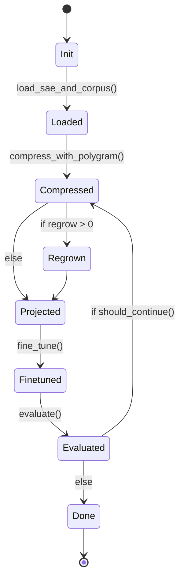

# sae-forge Algorithm

The clean mathematical and algorithmic foundation for sae-forge. This
document is the **source of truth** for how the forge process works
and why it is expected to succeed. It is written to be readable enough
to live alongside the README while staying formal enough for future
academic writing.

## 1. Core thesis

sae-forge converts a Polygram-compressed SAE into a small,
**feature-native transformer** whose residual stream *is* the
surviving interpretable feature space.

The surviving decoder rows (with original magnitudes preserved) become
the new basis for the entire model. Linear maps are projected
faithfully; nonlinearities and attention softmax are corrected via
fine-tuning.

## 2. Notation

- Original residual dimension: **d** (e.g. 2304 for Gemma-2-9B).
- Surviving features after compression: **k** (typically 200–1000).
- **B** ∈ ℝ^{k × d} — matrix whose **rows** are the surviving decoder
  vectors (original scale, post scale-aware merge if used).
- **E** ∈ ℝ^{d × k} — corresponding encoder slice (used for
  initialization).
- Feature activation vector: **z** ∈ ℝ^k. This becomes the new hidden
  state everywhere.

## 3. High-level algorithm

```python
def forge(original_model, sae_path, corpus, config):
    # 1. Compression (Polygram)
    comp = Compressor(
        sae=sae_path,
        strategy=config.compression_strategy,   # scale_aware_zero or scale_aware_merge
        rep_selection="scale_aware",
    ).run(corpus)

    B = comp.get_basis(scale="original")        # (k, d)
    E = comp.get_encoder_slice()                # (d, k)

    # 2. Create small model skeleton
    model = NativeModel(d_model=k, ...)

    # 3. Project weights
    projector = SubspaceProjector(B, E)
    model = projector.project_model(original_model, model)

    # 4. Optional iterative loop (controlled by orca-lang FSM)
    for i in range(config.iterations):
        if config.regrow_count > 0:
            B, E = regrow(B, E, model, corpus)
            projector.update_basis(B, E)

        model = fine_tune(model, corpus, epochs=config.epochs_per_cycle)

        metrics = evaluate(model, original_model, corpus)
        if not should_continue(metrics):
            break

    return model, metrics
```

## 4. Projection rules (simple and exact)

For any original weight matrix **W**:

- **Input side** → multiply left by **Eᵀ**.
- **Output side** → multiply right by **B** (or **Bᵀ** depending on
  the matrix-layout convention).

Concrete examples:

- Embeddings: `W_emb_new = E.T @ original_W_emb`
- Unembedding: `W_unemb_new = B`
- Q/K/V: `W_Q_new = E.T @ original_W_Q @ B.T`
- Output projection (O, MLP out): `W_O_new = E.T @ original_W_O`
- MLP gate/up: `W_in_new = E.T @ original_W_in @ B.T`

**Key property.** If the hidden state satisfies `x = B.T @ z`, then
all linear maps are exactly preserved on the subspace spanned by
**B**. Only softmax (attention) and elementwise nonlinearities
(GeLU/SwiGLU) introduce error.

## 5. Error sources and why fine-tuning works

The projected model has three main error terms:

1. **Rare / zeroed features** (`ε_rare`) — controlled by Polygram's
   behavioural + scale-aware validator.
2. **Attention geometry** (`ε_attn`) — from softmax acting on
   projected Q / K vectors.
3. **Nonlinearity mismatch** (`ε_nonlin`) — because GeLU does not
   commute with linear projection.

Fine-tuning directly optimizes these residual errors on the target
corpus. Because the initialization is geometrically faithful (linear
parts match exactly), gradients primarily correct the nonlinear
mismatches, leading to faster convergence and better retention of
original capabilities than generic distillation.

**Faithfulness probe choice matters.** The error terms above are
defined in the host's residual-stream coordinates — cosine /
`faithfulness_kl` measure how close the forged stream is to that.
But bio-sae's 2026-05-22 empirical work showed those metrics
systematically misrank forges for *downstream-task* users: cosine
goes negative under rank-deficient projection (algorithm.md's
expected behaviour), but the same forge can preserve 100 %+ of a
downstream SAE's per-feature AUC against ground-truth labels. The
amplification of `ε_attn` + `ε_nonlin` is *invisible* to cosine when
the rank deficit is in non-information-bearing directions; *visible*
to a capability metric that asks "does the forged model still
discriminate the GT labels the host did?". When downstream-task
fidelity matters, use
:class:`saeforge.eval.targets.DownstreamCapabilityTarget` and the
`sae-forge sweep-capability` Pareto sweep
(`add-downstream-capability-target`); cosine / KL stay the right
default for "is the residual stream numerically close" questions.

**Data-scale-robust width selection.** Single-shot
`sweep-capability` picks the argmax retained_mauc on whatever eval
sample is in scope. Bio-sae's residue-feed work showed that
argmax position drifts with data scale (n=16 at 10 proteins → n=48
at 100 proteins, both at retained_mauc ≈ 1.03). The peak value is
data-scale-stable; *which* width is the argmax isn't. For a
recommendation that survives more proteins arriving, use
:func:`saeforge.sweep_pareto_capability_progressive` (or the
`sae-forge sweep-capability-progressive` CLI). The wrapper drives
the sweep across an increasing-protein schedule and converges only
when the *smallest plateau-member* stops shifting across stages —
**Occam's razor at the forge layer** (among widths that explain the
labels equally well across data scales, pick the simplest). See
`add-progressive-capability-sweep` for the empirical motivation +
the connection to classical model selection (BIC / AIC / MDL).

## 6. FSM orchestration



The full machine definition lives in
[`saeforge/machines/sae_forge.orca.md`](../saeforge/machines/sae_forge.orca.md);
the OpenSpec change is
[`openspec/changes/forge-outer-loop-fsm/`](../openspec/changes/forge-outer-loop-fsm).

## 7. Theoretical guarantees (informal)

- Linear components of the original model are **exactly represented**
  in the new basis.
- The forged model is a **subspace-restricted approximation** of the
  original.
- Fine-tuning finds a nearby local minimum that corrects projection +
  nonlinearity errors.
- Iterative compression + regrowth is an alternating optimization
  procedure over basis + model weights.

## 8. Limitations and risks

- Loss of rare / long-tail capabilities (mitigated by corpus-specific
  compression).
- Potential drift of feature semantics during fine-tuning.
- Attention pattern distortion may require more fine-tuning steps
  than linear layers.

## 9. Acceptance criteria for v0

- Single-pass forge (`iterations=1`) runs end-to-end on GPT-2-small +
  toy SAE.
- Perplexity recovers to within reasonable bound of original after
  fine-tuning.
- Feature faithfulness metrics (ablation correlation, steering
  transfer) are strong.
- All projection math matches the formulas above (subject to the v0
  implementation notes below).

## 10. v0 implementation notes (where the shipped code differs)

The current v0 release matches the spirit of §4 — linear maps are
projected, nonlinearities are corrected by fine-tuning — but it makes
two deliberate engineering choices that diverge from the formulas as
written. Both are documented in the corresponding OpenSpec changes
and may converge with the spec in v1.

### 10.1 Encode direction uses `pinv(W_dec)`, not `Eᵀ`

The spec uses **Eᵀ** (the SAE's *encoder* slice, transposed) on the
input side of every projection. v0 instead uses the Moore-Penrose
pseudoinverse of the basis itself:

```
E_v0 = pinv(W_dec)        # shape (d, k)
```

For an ideal SAE (well-trained, full-rank decoder), `pinv(W_dec) ≈
encoder_slice` modulo encoder bias and ReLU thresholding. The
pseudoinverse is the least-squares optimal projection onto the
subspace spanned by the kept decoder rows; it preserves the §4 "Key
property" exactly without depending on the trained encoder's
fidelity. The tradeoff is that v0 ignores any non-trivial encoder
geometry the SAE learned beyond span-recovery — a reasonable choice
when scale-aware compression has already isolated the meaningful
basis directions.

### 10.2 Attention internal widths — host-inherited (default) or feature-native (v0.2 opt-in)

v0.2 ships **both** modes behind a `attention_width` knob on
`NativeModelConfig`, `ForgePipeline`, and the `--feature-native-attention`
CLI flag. Default is `"host"` to preserve byte-equivalence with v0
output; `"feature_native"` realizes the full §4 form.

**`attention_width="host"` (default)** — inherits the host's attention
internal width (`n_heads × head_dim`), projects only the residual-
touching edges:

```
W_Q_host = D @ W_Q          # shape (k, host_qkv_inner)
W_O_host = W_O @ E_v0       # shape (host_qkv_inner, k)
```

Keeps attention mechanics (softmax, head splitting) identical to
the host. Positional handling is family-specific:

- **GPT-2 family** — absolute positional embeddings via `wpe` are
  projected through `pinv` and added to the residual at entry; the
  forge reproduces the host's position-conditioning end-to-end.
- **Llama family** (Llama-3, Gemma-2, Qwen2, Qwen3, Qwen3-MoE) —
  RoPE applied to Q and K after projection-and-reshape, before the
  optional Q/K-norm and the scaled dot-product. Added by
  `add-llama-family-rope`; gated by `cfg.rope_mode in {"standard",
  "none"}` with `"standard"` default. The `"none"` arm reproduces
  the pre-fix no-RoPE behaviour byte-identically (regression-diff
  knob). See
  `openspec/specs/architecture-adapters/spec.md` for the per-family
  rollout contract.
- **Whisper-encoder** — sinusoidal positional embedding wired via
  the frozen-copied conv stem; unchanged by either projection mode.

Attention faithfulness preserved exactly when the basis spans the
full residual AND the family's positional encoding is honored. The
documented forge error budget gains `ε_rope` for the Llama-family
RoPE step alongside the existing `ε_attn` (Gemma sliding-window).

**`attention_width="feature_native"` (v0.2 opt-in)** — every dimension
becomes k-wide; both sides of c_attn / c_proj project per §4:

```
W_Q_fn = D @ W_Q @ E_v0     # shape (k, k)
W_O_fn = D @ W_O @ E_v0     # shape (k, k)
```

Identity-basis sanity check still holds in this mode (when `W_dec = I`,
`D @ W @ E = W`). Constraint: `n_features` must be divisible by
`num_heads` (the standard transformer constraint applied to the basis
width). Default is to inherit the host's `num_heads` and pick
`head_dim = n_features // num_heads`.

When to use which: if the basis spans most of the residual (e.g.
top-256 features in a 768-d model with strong SAE coverage), `host`
mode keeps attention numerics tight. If the basis is narrow but
fine-tuning is on the table, `feature_native` mode gives a smaller,
more interpretable model whose attention scores live in feature
space.

The exact algebra both modes ship is documented in the
[`SubspaceProjector` module docstring](../saeforge/projector.py) and
pinned by the
[`subspace-projector`](../openspec/changes/subspace-projector/specs/subspace-projector/spec.md)
+ [`feature-native-attention`](../openspec/changes/feature-native-attention/specs/feature-native-attention/spec.md)
capability specs.

v1.0 (separate change `feature-native-attention-default`) flips the
default to `feature_native`. v1.1 removes `host` mode entirely.

### 10.3 Polygram surface used by the shipped FSM

The spec's §3 pseudocode references `Compressor(...).run(corpus)`
returning an object with `get_basis()` and `get_encoder_slice()`
methods. The actual v0 wiring uses Polygram's existing
`Compressor.run(output_path)` →
`CompressionReport.from_json(...)` round-trip and reads the basis
back via `FeatureBasis.from_polygram_checkpoint`. Same data, slightly
different API shape; tracked in the
[`forge-outer-loop-fsm`](../openspec/changes/forge-outer-loop-fsm)
OpenSpec change.

### 10.4 Multi-architecture support — Llama-3 / Gemma-2 equivalents

The projection algebra in §4 is architecture-agnostic; v0.2 (the
`multi-architecture-support` OpenSpec change) extended sae-forge to
cover Llama-3 and Gemma-2 hosts via the
[`saeforge.adapters`](../saeforge/adapters/) registry. The
projection identities translate as:

- **GPT-2 fused `c_attn` (Q/K/V together)** ↔ **Llama-family
  `q_proj`, `k_proj`, `v_proj` separately**. Each Llama matrix is a
  residual-input matrix (HF stores `Linear.weight` as `(out, in)`);
  the projection is `W_new = W_old @ E` and shapes track the per-head
  output dimensions. GQA (`num_key_value_heads < num_attention_heads`)
  is honoured naturally — `k_proj` and `v_proj` shrink along the
  output axis.
- **GPT-2 GeLU MLP `c_fc` / `c_proj`** ↔ **Llama / Gemma-2 SwiGLU
  three-matrix MLP (`gate_proj`, `up_proj`, `down_proj`)**. `gate` and
  `up` are residual-input matrices; `down` is residual-output. The
  SwiGLU nonlinearity (`silu(gate(x)) * up(x)`) is `ε_nonlin`,
  same category as GeLU.
- **GPT-2 LayerNorm γ / β** ↔ **Llama / Gemma-2 RMSNorm γ (no β)**.
  The same `project_residual_aligned` helper applies; RMSNorm has no
  bias, so the walk emits no `*.bias` keys for any norm layer.
- **Gemma-2 four-norm-per-block layout**
  (`input_layernorm`, `post_attention_layernorm`,
  `pre_feedforward_layernorm`, `post_feedforward_layernorm`) — all
  four are residual-aligned RMSNorms; same projection helper,
  different forward-pass topology in the native module.

What is intentionally *not* replicated in v0.2:

- **Gemma-2 final-logit / attention soft-capping** — surfaced on the
  `NativeModelConfig` and applied at forward time as
  `tanh(x / cap) * cap`, but the projection itself is unaffected. Any
  drift between the post-cap host logits and the post-cap forged
  logits is `ε_nonlin` and falls out at fine-tune.
- **Gemma-2 alternating local/global attention** (sliding-window
  mask). The forged native module uses the standard causal mask
  everywhere; long-context drift is accepted as `ε_attn`. Replicating
  the exact sliding-window mechanics is future work.

### 10.5 Native model shape — non-LM families (Whisper encoder)

v0.4 (`forge-whisper-encoder`) extended `NativeModelConfig` to cover
encoder-shaped families. Two new knobs gate the LM-vs-encoder split,
both backward-compatible:

- `output_kind: str ∈ {"logits", "encoder_states"}` — defaults to
  `"logits"`. LM families produce vocab-shaped logits via an
  `lm_head`; encoder families produce per-frame hidden states with
  no vocab head. Cross-constraints: `output_kind == "logits"`
  requires `vocab_size > 0`; `output_kind == "encoder_states"`
  requires `vocab_size == 0` AND `family == "whisper_encoder"` (no
  other encoder family ships in v0.4).
- `vocab_size: int` — was a required field; now defaults to `0`.
  The `vocab_size > 0` invariant is enforced only when
  `output_kind == "logits"`, so LM callers see byte-identical
  behaviour from v0.3 and encoder callers can omit the field.

The projection algebra of §4 still applies to every residual-touching
weight in the encoder block (Q/K/V/O, fc1/fc2, the two per-block
LayerNorms, and the encoder-final LayerNorm). What's specific to
Whisper-encoder is *what is not projected*:

- **Mel conv stem (`conv1`, `conv2`)** — 1D temporal convolutions
  on the 80-mel input. Their kernels operate on a spatial structure,
  not the residual stream, so the projection rule in §4 does not
  define them. They are frozen-copied from the host bit-for-bit
  (`ε_conv`, accounted alongside the existing `ε_nonlin` / `ε_attn`
  in §5). Future work could attempt a spatial-aware projection;
  out of scope for v0.4.
- **`embed_positions.weight`** — Whisper's sinusoidal-in-spirit
  positional embeddings are stored as a learned tensor of shape
  `(max_source_positions, d_model)`. They are frozen-copied
  (matches the v0.1 GPT-2 `wpe` precedent — also copied unchanged).

Because the conv stem and positional embeddings live at the host's
`d_model` width while the transformer blocks operate at
`n_features`, the forged encoder needs an explicit d → f bridge at
the conv-stem → first-block boundary. This is the `basis_encode`
buffer, set by the adapter walk from
`projector.basis.pseudoinverse() * scale_boost` — the matrix form
of `SubspaceProjector.encode`. The buffer is state-dict-resident
(save/load round-trips it) but not in `named_parameters()`, so it
doesn't participate in gradient checkpointing or the
no-randomly-initialised-weights invariant.

Faithfulness signal for encoder forges is per-frame cosine
similarity in basis space (`saeforge.audio_eval.cosine_faithfulness`),
not KL — encoder states are real-valued per-frame vectors, not
distributions over a vocabulary. The dispatch lives in
`evaluate_faithfulness`; consumers downstream of the FSM read the
same `faithfulness` ctx field. See [`audio-forge.md`](audio-forge.md)
for the user-facing reference.
