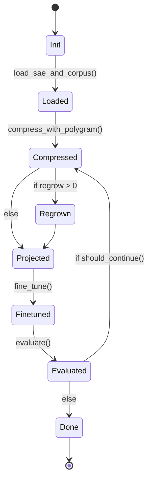

# sae-forge Algorithm

The clean mathematical and algorithmic foundation for sae-forge. This
document is the **source of truth** for how the forge process works
and why it is expected to succeed. It is written to be readable enough
to live alongside the README while staying formal enough for future
academic writing.

## 1. Core thesis

sae-forge converts a Polygram-compressed SAE into a small,
**feature-native transformer** whose residual stream *is* the
surviving interpretable feature space.

The surviving decoder rows (with original magnitudes preserved) become
the new basis for the entire model. Linear maps are projected
faithfully; nonlinearities and attention softmax are corrected via
fine-tuning.

## 2. Notation

- Original residual dimension: **d** (e.g. 2304 for Gemma-2-9B).
- Surviving features after compression: **k** (typically 200–1000).
- **B** ∈ ℝ^{k × d} — matrix whose **rows** are the surviving decoder
  vectors (original scale, post scale-aware merge if used).
- **E** ∈ ℝ^{d × k} — corresponding encoder slice (used for
  initialization).
- Feature activation vector: **z** ∈ ℝ^k. This becomes the new hidden
  state everywhere.

## 3. High-level algorithm

```python
def forge(original_model, sae_path, corpus, config):
    # 1. Compression (Polygram)
    comp = Compressor(
        sae=sae_path,
        strategy=config.compression_strategy,   # scale_aware_zero or scale_aware_merge
        rep_selection="scale_aware",
    ).run(corpus)

    B = comp.get_basis(scale="original")        # (k, d)
    E = comp.get_encoder_slice()                # (d, k)

    # 2. Create small model skeleton
    model = NativeModel(d_model=k, ...)

    # 3. Project weights
    projector = SubspaceProjector(B, E)
    model = projector.project_model(original_model, model)

    # 4. Optional iterative loop (controlled by orca-lang FSM)
    for i in range(config.iterations):
        if config.regrow_count > 0:
            B, E = regrow(B, E, model, corpus)
            projector.update_basis(B, E)

        model = fine_tune(model, corpus, epochs=config.epochs_per_cycle)

        metrics = evaluate(model, original_model, corpus)
        if not should_continue(metrics):
            break

    return model, metrics
```

## 4. Projection rules (simple and exact)

For any original weight matrix **W**:

- **Input side** → multiply left by **Eᵀ**.
- **Output side** → multiply right by **B** (or **Bᵀ** depending on
  the matrix-layout convention).

Concrete examples:

- Embeddings: `W_emb_new = E.T @ original_W_emb`
- Unembedding: `W_unemb_new = B`
- Q/K/V: `W_Q_new = E.T @ original_W_Q @ B.T`
- Output projection (O, MLP out): `W_O_new = E.T @ original_W_O`
- MLP gate/up: `W_in_new = E.T @ original_W_in @ B.T`

**Key property.** If the hidden state satisfies `x = B.T @ z`, then
all linear maps are exactly preserved on the subspace spanned by
**B**. Only softmax (attention) and elementwise nonlinearities
(GeLU/SwiGLU) introduce error.

## 5. Error sources and why fine-tuning works

The projected model has three main error terms:

1. **Rare / zeroed features** (`ε_rare`) — controlled by Polygram's
   behavioural + scale-aware validator.
2. **Attention geometry** (`ε_attn`) — from softmax acting on
   projected Q / K vectors.
3. **Nonlinearity mismatch** (`ε_nonlin`) — because GeLU does not
   commute with linear projection.

Fine-tuning directly optimizes these residual errors on the target
corpus. Because the initialization is geometrically faithful (linear
parts match exactly), gradients primarily correct the nonlinear
mismatches, leading to faster convergence and better retention of
original capabilities than generic distillation.

## 6. FSM orchestration



The full machine definition lives in
[`saeforge/machines/sae_forge.orca.md`](../saeforge/machines/sae_forge.orca.md);
the OpenSpec change is
[`openspec/changes/forge-outer-loop-fsm/`](../openspec/changes/forge-outer-loop-fsm).

## 7. Theoretical guarantees (informal)

- Linear components of the original model are **exactly represented**
  in the new basis.
- The forged model is a **subspace-restricted approximation** of the
  original.
- Fine-tuning finds a nearby local minimum that corrects projection +
  nonlinearity errors.
- Iterative compression + regrowth is an alternating optimization
  procedure over basis + model weights.

## 8. Limitations and risks

- Loss of rare / long-tail capabilities (mitigated by corpus-specific
  compression).
- Potential drift of feature semantics during fine-tuning.
- Attention pattern distortion may require more fine-tuning steps
  than linear layers.

## 9. Acceptance criteria for v0

- Single-pass forge (`iterations=1`) runs end-to-end on GPT-2-small +
  toy SAE.
- Perplexity recovers to within reasonable bound of original after
  fine-tuning.
- Feature faithfulness metrics (ablation correlation, steering
  transfer) are strong.
- All projection math matches the formulas above (subject to the v0
  implementation notes below).

## 10. v0 implementation notes (where the shipped code differs)

The current v0 release matches the spirit of §4 — linear maps are
projected, nonlinearities are corrected by fine-tuning — but it makes
two deliberate engineering choices that diverge from the formulas as
written. Both are documented in the corresponding OpenSpec changes
and may converge with the spec in v1.

### 10.1 Encode direction uses `pinv(W_dec)`, not `Eᵀ`

The spec uses **Eᵀ** (the SAE's *encoder* slice, transposed) on the
input side of every projection. v0 instead uses the Moore-Penrose
pseudoinverse of the basis itself:

```
E_v0 = pinv(W_dec)        # shape (d, k)
```

For an ideal SAE (well-trained, full-rank decoder), `pinv(W_dec) ≈
encoder_slice` modulo encoder bias and ReLU thresholding. The
pseudoinverse is the least-squares optimal projection onto the
subspace spanned by the kept decoder rows; it preserves the §4 "Key
property" exactly without depending on the trained encoder's
fidelity. The tradeoff is that v0 ignores any non-trivial encoder
geometry the SAE learned beyond span-recovery — a reasonable choice
when scale-aware compression has already isolated the meaningful
basis directions.

### 10.2 Attention internal widths — host-inherited (default) or feature-native (v0.2 opt-in)

v0.2 ships **both** modes behind a `attention_width` knob on
`NativeModelConfig`, `ForgePipeline`, and the `--feature-native-attention`
CLI flag. Default is `"host"` to preserve byte-equivalence with v0
output; `"feature_native"` realizes the full §4 form.

**`attention_width="host"` (default)** — inherits the host's attention
internal width (`n_heads × head_dim`), projects only the residual-
touching edges:

```
W_Q_host = D @ W_Q          # shape (k, host_qkv_inner)
W_O_host = W_O @ E_v0       # shape (host_qkv_inner, k)
```

Keeps attention mechanics (softmax, head splitting, positional
handling) identical to the host. Attention faithfulness preserved
exactly when the basis spans the full residual.

**`attention_width="feature_native"` (v0.2 opt-in)** — every dimension
becomes k-wide; both sides of c_attn / c_proj project per §4:

```
W_Q_fn = D @ W_Q @ E_v0     # shape (k, k)
W_O_fn = D @ W_O @ E_v0     # shape (k, k)
```

Identity-basis sanity check still holds in this mode (when `W_dec = I`,
`D @ W @ E = W`). Constraint: `n_features` must be divisible by
`num_heads` (the standard transformer constraint applied to the basis
width). Default is to inherit the host's `num_heads` and pick
`head_dim = n_features // num_heads`.

When to use which: if the basis spans most of the residual (e.g.
top-256 features in a 768-d model with strong SAE coverage), `host`
mode keeps attention numerics tight. If the basis is narrow but
fine-tuning is on the table, `feature_native` mode gives a smaller,
more interpretable model whose attention scores live in feature
space.

The exact algebra both modes ship is documented in the
[`SubspaceProjector` module docstring](../saeforge/projector.py) and
pinned by the
[`subspace-projector`](../openspec/changes/subspace-projector/specs/subspace-projector/spec.md)
+ [`feature-native-attention`](../openspec/changes/feature-native-attention/specs/feature-native-attention/spec.md)
capability specs.

v1.0 (separate change `feature-native-attention-default`) flips the
default to `feature_native`. v1.1 removes `host` mode entirely.

### 10.3 Polygram surface used by the shipped FSM

The spec's §3 pseudocode references `Compressor(...).run(corpus)`
returning an object with `get_basis()` and `get_encoder_slice()`
methods. The actual v0 wiring uses Polygram's existing
`Compressor.run(output_path)` →
`CompressionReport.from_json(...)` round-trip and reads the basis
back via `FeatureBasis.from_polygram_checkpoint`. Same data, slightly
different API shape; tracked in the
[`forge-outer-loop-fsm`](../openspec/changes/forge-outer-loop-fsm)
OpenSpec change.
