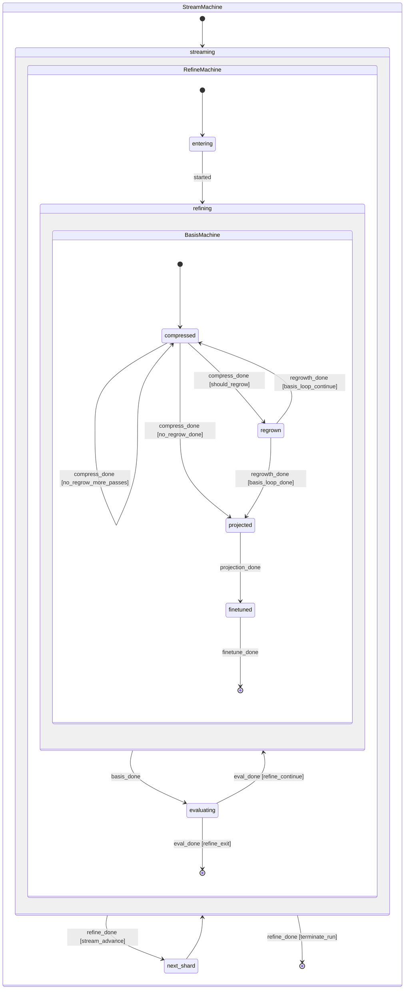

# Design: hierarchical-fsm

## Why three machines, not two or four

The forge has exactly three nesting levels with distinct concerns,
each governed by a different ctx subset:

| Level | Concern | Drives | Ctx subset |
|---|---|---|---|
| Stream | "Which shard / task am I on?" | `task_idx`, `n_tasks`, `task_trigger`, `replay_*` | shard-scope |
| Refine | "Has the same shard converged?" | `iterations`, `current_iter`, `should_continue`, `min_faithfulness`, `faithfulness` | shard-scope |
| Basis | "Has the basis itself converged?" | `inner_refine_idx`, `inner_refine_passes`, `regrow_count`, `protected_features`, `feature_usage` | per-pass scope |

A two-machine split (stream + everything-else) leaves the
basis-loop / refine-loop boundary buried inside one machine —
exactly the readability problem we're solving. A four-machine
split (e.g. peeling off a "fine-tune" sub-machine) front-loads
boilerplate without buying anything: fine-tune is a single
state with a single action, not a loop.

## Composition mechanism: native orca multi-machine

Per the orca syntax reference (MCP server, "Multi-machine: separate
files with ---, use invoke: ChildMachine in states") the runtime
composes machines by:

1. Concatenating the three `.orca.md` files separated by `---`.
2. Declaring a state in the parent machine as compound via
   `invoke: ChildName` in its body.
3. Wiring a transition out of the compound state on the child
   machine's `[final]` state.

The orchestrator does *not* implement composition itself. The
existing `_derive_canonical_events` helper extends to handle
compound states by emitting the "child reached final" event when
the inner machine terminates. This is the only structural change
to the orchestrator — the rest of `run_machine` is unchanged.

This is the right place to *lean on orca-runtime-python* (per the
"lean on orca-lang" note) rather than building a Python composition
layer. If the runtime turns out to lack a feature this design
needs (e.g. ctx scoping at the sub-machine boundary), that gap is
a runtime PR, not a sae-forge workaround.

**Loader API decision (resolved during implementation, task §1.3):**
The orchestrator's loader currently expects exactly one `.orca.md`
resource. Two implementation paths exist:

1. **Preferred — runtime helper.** If `orca_runtime_python` exposes
   a `parse_orca_files(paths)` (or equivalent multi-file) helper,
   use it directly. This keeps the orchestrator thinner and lets
   the runtime own multi-file semantics (resource resolution,
   error messages on duplicate machine names, etc.).
2. **Fallback — string concatenation.** If the runtime only exposes
   `parse_orca_md(text)`, the loader reads the three files via
   `importlib.resources` and joins them with `\n---\n` before
   parsing. This is a ~15-line change and is the path the spec
   delta describes as the lower bound of compatibility.

Task §1.3 explicitly probes the runtime API and pins the choice
in a one-line comment in `saeforge/orchestrator.py` so future
readers see *which* path was taken and why. The capability spec
allows either path — both produce the same composed definition.

### Filename convention

Sub-machine files use short lowercase names (`stream.orca.md` /
`refine.orca.md` / `basis.orca.md`) matching the existing v0.2
file `sae_forge.orca.md`. The longer `StreamMachine.orca.md` form
was considered for symmetry with the `# machine StreamMachine`
header inside, but rejected — short filenames match repo
convention and stay readable in path strings (e.g. error
messages, resource lookups). The `# machine X` header inside
each file is the canonical machine identifier the runtime uses.

## Sub-machine definitions

### Stream machine (outermost)

```
# machine StreamMachine
## state init [initial]
## state streaming
> invoke: RefineMachine
## state next_shard
## state done [final]
## state failed [final]

## transitions
| init       | start       |                                | streaming  | initialize_stream    |
| streaming  | refine_done | stream_advance                 | next_shard | advance_to_next_task |
| streaming  | refine_done | terminate_run                  | done       | save_final_model     |
| next_shard | shard_loaded |                               | streaming  |                      |
| streaming  | error       |                                | failed     | log_error            |
```

The `stream_advance` and `terminate_run` guards read the same ctx
fields as today (`advance_stream`, `should_continue`); their
expressions are copied verbatim from the v0.2 flat machine. The
`refine_same_shard` case (today's third evaluated-edge target) is
handled *inside* RefineMachine — the refine machine doesn't return
to the stream until either `advance_stream` or termination fires.

### Refine machine (middle)

```
# machine RefineMachine
## state entering [initial]
## state refining
> invoke: BasisMachine
## state evaluating
## state exiting [final]
## state failed [final]

## transitions
| entering   | started        |                       | refining   | load_and_scan        |
| refining   | basis_done     |                       | evaluating | (passthrough)        |
| evaluating | eval_done      | refine_continue       | refining   | rotate_for_next_iter |
| evaluating | eval_done      | refine_exit           | exiting    |                      |
| entering   | error          |                       | failed     | log_error            |
| refining   | error          |                       | failed     | log_error            |
| evaluating | error          |                       | failed     | log_error            |
```

`load_and_scan` is a *composed* action: under the hood it calls
`load_sae_and_corpus` and then `scan_activations` in sequence. The
two-action collapse is a structural simplification — the v0.2
machine has these as two separate states (`loaded`,
`activations_scanned`) which leak the implementation detail that
scanning is gated by `protect_top_k > 0`. Keeping them as one
state in RefineMachine matches the user-facing mental model
("refine entry sets up the shard"). The byte-equivalence test
verifies that the action ordering is preserved.

`refine_continue` reads `ctx.advance_stream == false ∧
ctx.should_continue == true` — exactly today's `refine_same_shard`
guard. `refine_exit` reads everything else (the OR of
`stream_advance` and `terminate_run`); the stream machine then
disambiguates which final state to enter.

### Basis machine (innermost)

```
# machine BasisMachine
## state compressed [initial]
## state regrown
## state projected
## state finetuned
## state done [final]
## state failed [final]

## transitions
| compressed | started      |                              | compressed | compress_with_polygram |
| compressed | compress_done | should_regrow              | regrown    | perform_regrowth       |
| compressed | compress_done | no_regrow_more_passes      | compressed | compress_with_polygram |
| compressed | compress_done | no_regrow_done             | projected  | project_to_subspace    |
| regrown    | regrowth_done | basis_loop_continue        | compressed | compress_with_polygram |
| regrown    | regrowth_done | basis_loop_done            | projected  | project_to_subspace    |
| projected  | projection_done |                            | finetuned  | fine_tune_model        |
| finetuned  | finetune_done |                              | done       |                        |
| compressed | error        |                              | failed     | log_error              |
| regrown    | error        |                              | failed     | log_error              |
| projected  | error        |                              | failed     | log_error              |
| finetuned  | error        |                              | failed     | log_error              |
```

These are the v0.2 transitions verbatim, minus the `evaluated`
state (which moves up to RefineMachine) and the `loaded` /
`activations_scanned` entry pair (which collapses into RefineMachine's
`entering` state). Every guard expression is copied byte-for-byte
from the v0.2 machine. The basis-loop counters
(`inner_refine_idx`, `inner_refine_passes`) live in shared ctx and
the action `perform_regrowth` increments `inner_refine_idx` exactly
as today.

## Ctx scoping

Orca runtime composes machines over a *shared* ctx by default —
there is no per-sub-machine ctx isolation, and we don't want any.
The continual-learning v0.2 fields are shared by design (e.g.
`feature_usage` is scored in `scan_activations` at refine entry
and read in `compress_with_polygram` inside the basis loop).

What the hierarchy adds is *a runtime-tracked machine path* on the
ctx for debugging:

```python
# saeforge/context.py (existing dataclass extended)
_machine_path: str = "stream"  # set by runtime; format: "stream", "stream/refine", "stream/refine/basis"
```

`_machine_path` is read-only from the action side (actions never
mutate it; the runtime updates it on push/pop). The
`transitions_log` action helper appends `_machine_path` as
`machine_path` on every entry. This costs one string per
transition log entry and pays for itself the first time a basis
loop misbehaves and you need to read the log.

## Action signatures

All action signatures are byte-identical to v0.2:
`(ctx: dict, payload: dict | None = None) -> dict | None`. The
ACTION_TABLE registration call in the orchestrator is unchanged.
The proposal's draft mention of "minor updates to action
signatures for better hierarchical context passing" is rejected
here in favor of zero churn — we do not need new parameters.

## Visualization

`saeforge/machines/visualize.py` produces a single Mermaid
`stateDiagram-v2` block:



This is generated *from* the parsed hierarchy, not hand-maintained.
A test asserts the generated Mermaid renders without errors via
`mermaid-cli` if available, with a graceful skip when not.

## Byte-equivalence: the load-bearing test

`test_imperative_and_fsm_byte_equivalent` (existing) is the
non-negotiable acceptance gate. It runs:

1. The pure-Python orchestrator implementation
   (`saeforge/forge.py:_run_imperative`) on a fixed seed.
2. The FSM via `run_machine` on the same seed.
3. Asserts the resulting `final_model_path` artifacts are
   byte-identical, the `transitions_log` action sequences match
   (modulo the new `machine_path` key, which is filtered out for
   comparison), and the final ctx scalar fields agree exactly.

The test is updated only to filter `machine_path` out of the log
entries before comparison. If this test fails after the refactor,
the refactor is wrong, full stop — we do not rebaseline it.

## Failure-state consolidation

The v0.2 machine has a single `failed` final state with eight
transitions into it. The hierarchy has a `failed` final state in
each of the three sub-machines, plus a top-level `failed` in
StreamMachine. An error inside BasisMachine bubbles up: BasisMachine
enters its local `failed`, RefineMachine sees the child reach a
final state and propagates via `error` event to its own `failed`,
and StreamMachine does the same.

`log_error` is registered in all three machines and writes the
same `error_message` ctx field as today. The byte-equivalence test
covers a forced-error case to verify the propagation path produces
the same final ctx as the v0.2 single-failed-state machine.

### Richer error context (additive, behind the bubble path)

`error_message` itself is unchanged for byte-equivalence — the same
`f"{type(e).__name__}: {e}"` string the v0.2 orchestrator's `_step`
helper produces. The hierarchy adds *additive* context at each
bubble step:

- BasisMachine's `log_error` writes `error_origin_machine = "basis"`
  to ctx alongside `error_message`.
- RefineMachine's `log_error` reads `error_origin_machine` if
  present (preserving the deepest origin) and otherwise writes
  `"refine"`.
- StreamMachine's `log_error` does the same with `"stream"` as the
  fallback.

The result: `ctx["error_origin_machine"]` after a failed run names
the deepest sub-machine that originated the error. This is the
debug payload the reviewer flagged as a nice-to-have — it costs
one extra ctx field, no behavior change, and only rich-error
consumers read it. The byte-equivalence test ignores
`error_origin_machine` (it's a hierarchy-only field with no v0.2
counterpart). Documented as the per-machine error contract in
the `hierarchical-fsm` spec's failure-propagation requirement.

## Migration mechanics

There is no user-facing migration. The single
`saeforge/machines/sae_forge.orca.md` package resource is removed
in the same commit that adds the three replacement files. The
orchestrator's `load_machine_definition()` call site is updated in
the same commit. There is no transitional state where both the
flat machine and the hierarchy coexist — they would have
conflicting state names and the byte-equivalence test would be
ambiguous.

CLI users supplying `--print-fsm` get the new Mermaid diagram
instead of the old flat-machine dump. This is a debug-surface
change, not an API change; documented in the changelog.

## Risks and rejected alternatives

### Rejected: keep the flat machine, add documentation

The v0.2 doc-vs-code drift is already a recurring review comment.
Doubling down on better prose to describe a machine that doesn't
self-describe its structure is a losing maintenance bet over the
adaptive-regrow + multi-objective-triggers horizon.

### Rejected: build a Python-side hierarchy.py composition layer

The user feedback memory ("for FSM-adjacent work, check
orca-runtime-python features before writing Python plumbing") is
explicit. Composing in Python would also defeat the orca topology
checker's reach — it operates on parsed orca, not on Python objects.

### Risk: the runtime's compound-state semantics are under-tested

`orca_runtime_python` ships compound-state support in the parser,
but the project hasn't exercised it before. The implementation
plan starts with a topology-checker probe on a trivial two-machine
fixture *before* migrating the real machines, so we discover
runtime gaps with a five-minute test rather than a five-day
debug. If a gap surfaces, we file it upstream and the change is
parked, not worked around in Python.

### Risk: Mermaid diagram drifts from the orca files

Mitigated by generating it from the parsed hierarchy on every
docs build, with a CI check that the committed diagram in
`docs/advanced-fsm-options.md` matches `visualize.py`'s output
for the current machine files.

## Why this is internal-only

This refactor changes no observable behavior, no public API, no
on-disk artifact, no CLI flag (the new `--fsm-diagram` flag is
purely additive), and no ctx field semantics. The
`forge-outer-loop` capability spec is modified only to *reframe*
the existing requirements as a hierarchy — the requirements
themselves preserve their truth tables exactly. A reader of the
v0.2 spec and a reader of the post-this-change spec would write
the same code; this change is about which structure the spec
imposes on that code.
